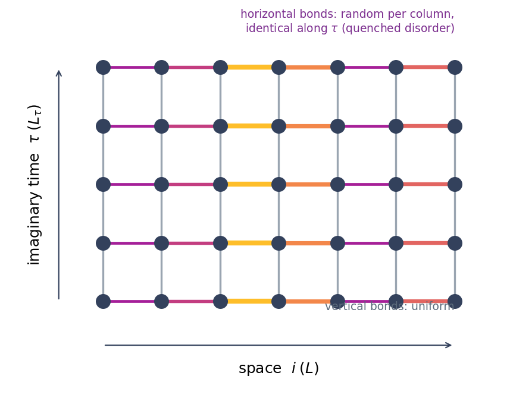
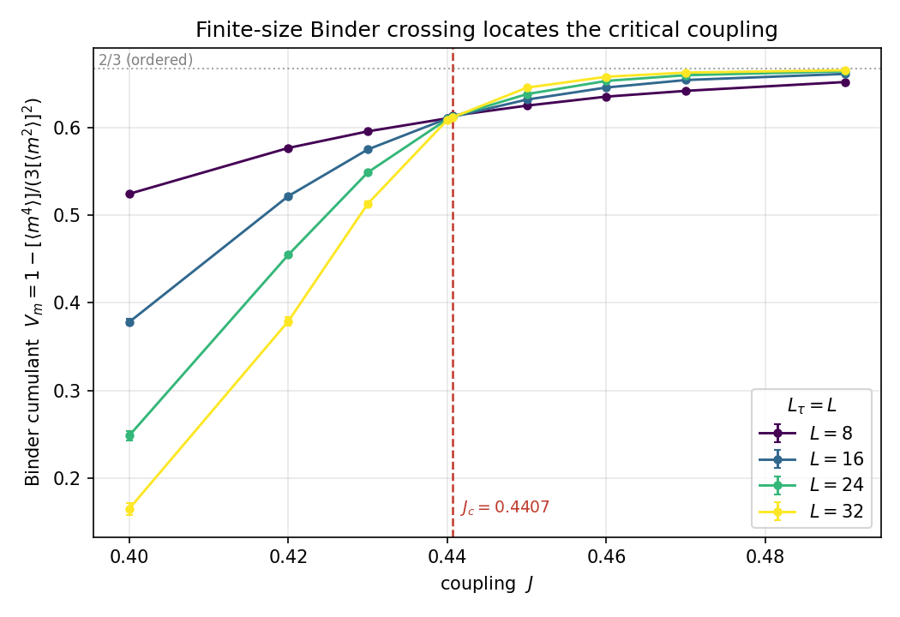
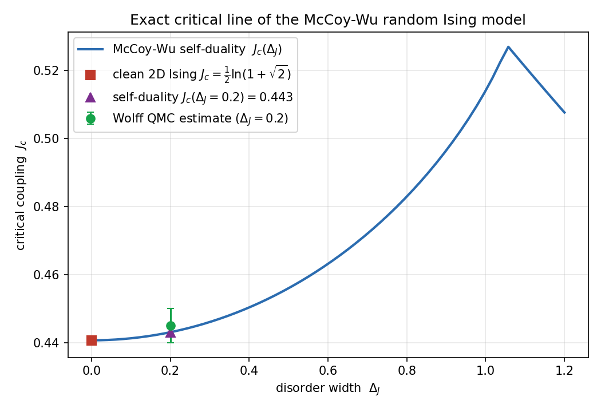
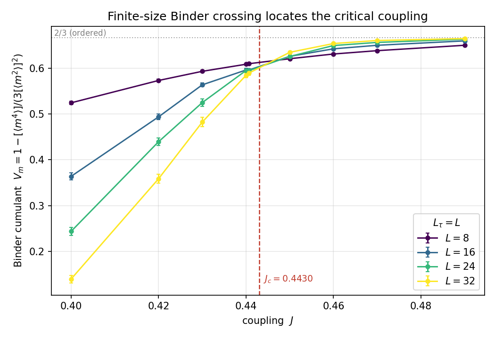

# Random Transverse-Field Ising Model — Cluster Quantum Monte Carlo

Cluster-algorithm **quantum Monte Carlo** for the one-dimensional **random
transverse-field Ising chain (RTFIM)**, studied through its imaginary-time
mapping onto the **(1+1)-dimensional McCoy–Wu classical Ising model**. The goal
is to locate and characterize the **infinite-randomness quantum critical point**
that governs this disordered quantum magnet.

Author: **Arash Bellafard** (UCLA). This repository includes a draft manuscript
(`manuscript/`), the simulation code, the statistical-analysis pipeline, and
reproducible figures.

---

## The model

The RTFIM is a spin-1/2 chain with random ferromagnetic bonds and a
random transverse field,

$$
H  =  -\sum_{i=1}^{L} J_i \sigma^{z}_i \sigma^{z}_{i+1} - \sum_{i=1}^{L} h_i \sigma^{x}_i ,
$$

with $J_i, h_i > 0$ drawn from disorder distributions. Even weak randomness is a
strong perturbation in one dimension: the chain flows to an **infinite-randomness
fixed point** where the usual power-law quantum criticality is replaced by
*activated* dynamical scaling.

### Imaginary-time (McCoy–Wu) mapping

The quantum partition function $Z=\mathrm{Tr} e^{-\beta H}$ becomes a classical
path integral in $d+1$ dimensions. Discretizing imaginary time into $L_\tau$
slices gives a 2D classical Ising model with the action

$$
\mathcal{S}_{\mathrm{MW}} = -\sum_{\tau,i} J_i S_i(\tau) S_{i+1}(\tau) - \sum_{\tau,i} J S_i(\tau) S_i(\tau+1),
$$

with classical Ising spins $S_i(\tau) = \pm 1$.

The disorder is **columnar**: the spatial couplings $J_i$ are random but
*identical in every time slice* (quenched, perfectly correlated along imaginary
time), while the temporal couplings are uniform. This is precisely the
**McCoy–Wu random Ising model**, the classical avatar of the quantum RTFIM. The
spatial couplings are drawn from a rectangular distribution of mean $J$ and width
$\Delta_J$,

$$
\pi(J_i) = \frac{1}{\Delta_J}
$$

for $J - \Delta_J/2 < J_i < J + \Delta_J/2$ (and zero otherwise), with $J$ the
tuning parameter.



## Method: single-cluster Wolff QMC

Because there is no frustration, highly efficient **cluster updates** apply. A
Wolff cluster is grown by adding an aligned neighbour across a bond of coupling
$K$ with probability

$$
p_{\mathrm{add}} = 1 - e^{-2K},
$$

and the whole cluster is flipped at once, essentially eliminating critical
slowing down. For each quenched realization we accumulate the Monte Carlo moments
$\langle m^2\rangle$ and $\langle m^4\rangle$ of the magnetization
$m = \frac{1}{L L_\tau}\sum_{\tau,i} S_i(\tau)$, and average over disorder to form
the **magnetic Binder cumulant**

$$
V_m  =  1 - \frac{[\langle m^4\rangle]}{3 [\langle m^2\rangle]^{2}},
$$

where $\langle\cdots\rangle$ is the Monte Carlo (thermal) average and
$[\cdots]$ the disorder average. Error bars come from a **jackknife** over
disorder realizations. In the ordered phase $V_m\to 2/3$; in the disordered phase
$V_m\to 0$; the size-independent crossing marks the critical coupling $J_c$.

## Validation: exact 2D Ising crossing

With no disorder ($\Delta_J=0$) the model *is* the clean 2D Ising model, whose
critical point is known exactly, $J_c=\frac{1}{2}\ln(1+\sqrt{2})=0.440687$. The Wolff
QMC reproduces it: the Binder curves for $L=8,16,24,32$ cross exactly there.



## Result: the random critical point

The exact McCoy–Wu critical line follows from self-duality,

$$
2J + \big\langle \ln \tanh J' \big\rangle = 0,
$$

which reduces to $2J+\ln\tanh J=0$ (the exact Ising point) as $\Delta_J\to 0$ and
shifts upward with disorder. For $\Delta_J=0.2$ it gives $J_c\approx 0.443$.



The disorder-averaged Wolff QMC (jackknife error bars, $\Delta_J=0.2$) locates the
crossing consistently, $J_c \approx 0.445 \pm 0.005$:



## Activated dynamical scaling

At the infinite-randomness fixed point, imaginary-time and spatial scales are
related *activatedly*,

$$
\ln L_\tau \sim L^{\psi},
$$

with tunneling exponent $\psi\approx 0.45$, rather than by a conventional
dynamical exponent $z$. The Binder data for different $L$ collapse when plotted
against $\ln(L_\tau)/L^{\psi}$ — the analysis implemented in
`analysis/plot_activated_scaling.py`.

## Repository layout

```
.
├── src/rtfim_wolff_qmc.cc        clean Wolff cluster QMC (from-scratch)
├── analysis/
│   ├── plot_binder.py            disorder-averaged Binder crossing (jackknife)
│   ├── mccoy_wu_critical_line.py  exact self-duality critical line
│   ├── draw_lattice.py           McCoy–Wu lattice schematic
│   ├── binder_reduce.py          reduce raw |m| series -> V_m(L, L_tau)
│   └── plot_activated_scaling.py  infinite-randomness scaling collapse
├── demo/run_binder_sweep.sh      Binder sweep driver
├── manuscript/                        draft manuscript (LaTeX) + bibliography
├── figures/
├── Makefile
└── LICENSE
```

The full production code additionally implements the $N$-color **Ashkin–Teller**
generalization (a four-spin inter-color coupling) and a Wolff-sweep
autocorrelation diagnostic; this repository ships the clean single-color engine
that reproduces the results above.

## Build & run

Requires a C++ compiler and Python 3 (`numpy`, `scipy`, `matplotlib`).

```bash
make                 # build ./bin/rtfim_wolff_qmc
make figures         # run the sweeps + regenerate all figures

# direct use:
./bin/rtfim_wolff_qmc  L Ltau J DeltaJ N_real N_eq N_meas [seed]
./bin/rtfim_wolff_qmc  16 16 0.4407 0.0 40 300 1500
```

## References

- B. M. McCoy and T. T. Wu, *Theory of a two-dimensional Ising model with random
  impurities*, Phys. Rev. **176**, 631 (1968).
- D. S. Fisher, *Critical behavior of random transverse-field Ising spin chains*,
  Phys. Rev. B **51**, 6411 (1995).
- H. Rieger and A. P. Young, *Griffiths singularities in the disordered phase of a
  quantum Ising spin glass*, Phys. Rev. B **54**, 3328 (1996).
- K. Binder, *Finite size scaling analysis of Ising model block distribution
  functions*, Z. Phys. B **43**, 119 (1981).

## License

Released under the MIT License — see [LICENSE](LICENSE).
